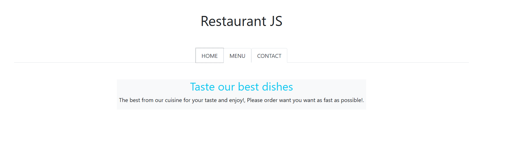
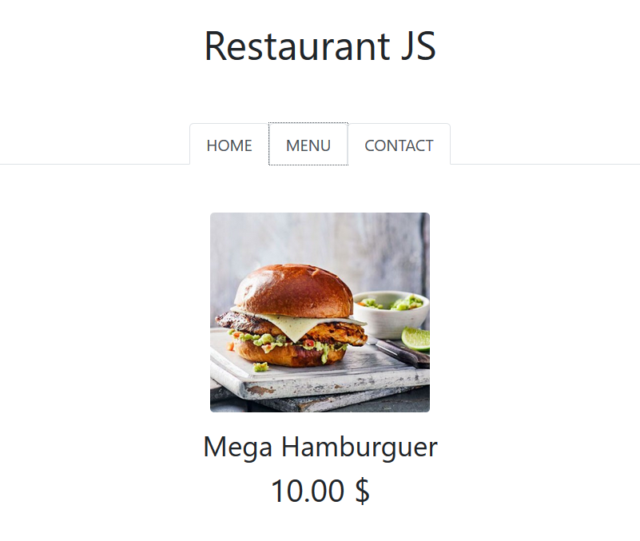

# Restaurant

In this project I apply the knowgledge of JavaScript to manipulate the DOM and to show the use of Webpack.
The entire project contains three pages. 
- Home page
- Menu
- Contact




## Built With

- HTML
- CSS
- Bootstrap
- JavaScript

## Live Preview

[Restaurant Page](https://rawcdn.githack.com/alejandrotoledoweb/js_restaurant/7d03c46746c2c9fc0fa5f45ee9b650a58c35e557/dist/index.html)

## Getting Started

To get a local copy up and running follow these simple example steps.

### Prerequisites

Install [NodeJs](https://nodejs.org/en/download/)

### Setup

Clone the repository to your local computer

To install dependencies you need to run the following command in your terminal.

```
  npm install
```

### Usage

Open `index.html` file from the cloned repository.

**Build** to compile once your code.

```
    npm run build
```

**Watch** script to compile everytime you make a change, great combination with live server extension.

```
    npm run watch
```

## Authors

👤  **Alejandro Toledo**


- GitHub: [@alejandrotoledoweb](https://github.com/alejandrotoledoweb)
- Twitter: [@alejot](https://twitter.com/alejot)
- LinkedIn: [Alejandro Toledo](https://www.linkedin.com/in/alejandro-toledo-3b444b109/)


## 🤝 Contributing

Contributions, issues, and feature requests are welcome!

Feel free to check the [issues page](https://github.com/alejandrotoledoweb/js_restaurant/issues).

## Show your support

Give a ⭐️ if you like this project!